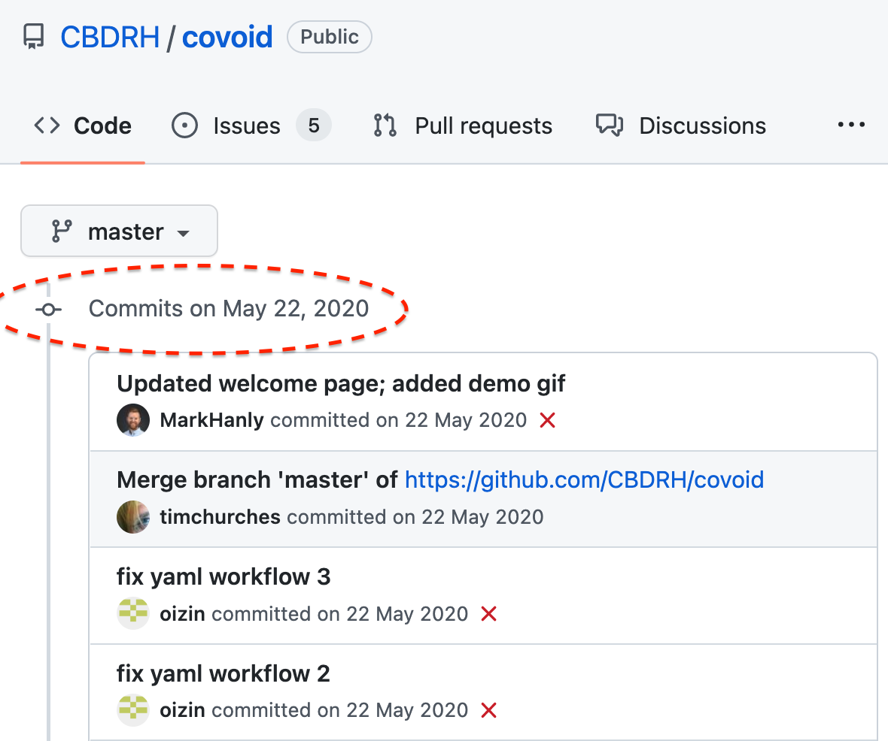
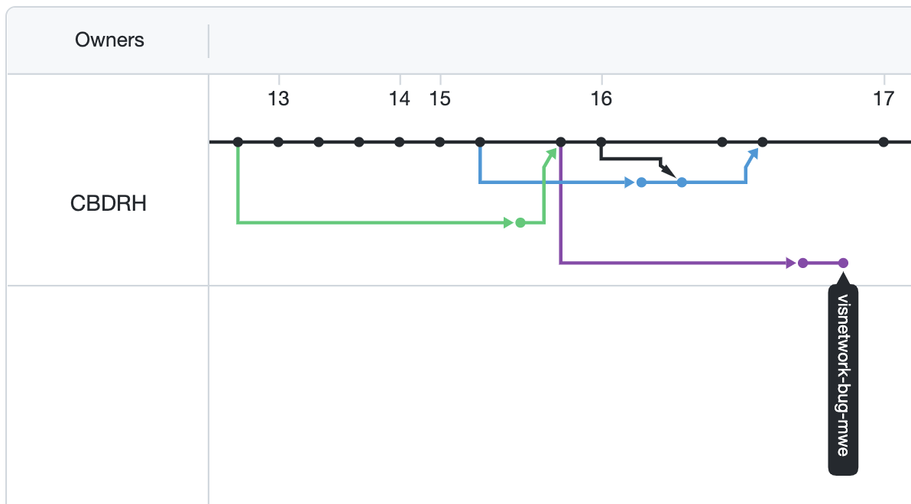

background-image: url(https://github.githubassets.com/images/modules/logos_page/GitHub-Mark.png)

```{r setup, include=FALSE}
options(htmltools.dir.version = FALSE)
```

???

Image credit: [Wikimedia Commons](https://commons.wikimedia.org/wiki/File:Sharingan_triple.svg)


---

# Git? GitHub? GitWhat?

So what is Git and how is it different to GitHub?

.pull-left[


Git is software for tracking different versions of code files you are working on locally. 
]

.pull-right[


Git Hub is a cloud-based platform for sharing and collaborating on projects managed with Git
]


---
class: left, top, inverse

# Why use Git and GitHub?


---
class: left, top, inverse

# Why use Git and GitHub?

### 1. Version control 

### 2. Collaboration

### 3. Organisation 

--

All of these promote **_reproducibility_** `r emo::ji('party')` and **_transparency_** `r emo::ji('dance')`


---
class: left, top

# Why use Git and GitHub?

.left-column[

### 1. Version control

Keep a log of changes to your code

Explore this example [here](https://github.com/CBDRH/vaccineQueue/commits/main)

]

.right-column[


]


---
class: left, top

# Why use Git and GitHub?

.left-column[

### 1. Version control 

Easily search, navigate and compare this history

Explore this example [here](https://github.com/CBDRH/vaccineQueue/commits/main)

]

.right-column[


]


---
class: left, top

# Why use Git and GitHub?

.left-column[

### 1. Version control 

You can even compare difference versions of images! 

* This works for PNG, JPG, GIF, and PSD

You can try this example [here](https://github.com/MarkHanly/getting-started-with-git-and-github/commit/6a071a9c63ee211e63417efba10a24042d0b0db3)

]

.right-column[


]


---
class: left, top

# Why use Git and GitHub?

.left-column[

### 2. Collaborate 

GitHub offers powerful collaboration features

]

.right-column[


]


---
class: left, top

# Why use Git and GitHub?

.left-column[

### 2. Collaborate 

Edit code simultaneously 

(Here, three people are panicking before a deadline)

Explore this example [here](https://github.com/CBDRH/covoid/commits/master)
]

.right-column[



]


---
class: left, top

# Why use Git and GitHub?

.left-column[

### 2. Collaborate 

Built-in issue tracking

* Assign a user 
* Link to the code 

Explore this example [here](https://github.com/CBDRH/covoid/issues/20)
]

.right-column[


]


---
class: left, top

# Why use Git and GitHub?

.left-column[

### 2. Collaborate 

Branching  

* Develop new ideas in separate branches 
* When you're ready, merge into the code base


Explore this example [here](https://github.com/CBDRH/covoid/network)
]

.right-column[



]


---
class: left, top

# Why use Git and GitHub?

.left-column[

### 3. Organise

Everything gets stored together 

* Data 
* Code 
* Figures 
* Articles

Explore this example [here](https://github.com/CBDRH/vaccineQueue)

]

.right-column[


]


---
class: left, top

# Why use Git and GitHub?

.left-column[

### 3. Organise

Easy web presence 

* github.com 
* blogs 
* These slides!

Explore this example [here](https://github.com/CBDRH/vaccineQueue)

]

.right-column[


]


---
class: left, top

# Why use Git and GitHub?

.left-column[

### 3. Organise

[Bryan 2018](https://doi.org/10.1080/00031305.2017.1399928)

]

.right-column[

> A GitHub-synced Git repo can simultaneously be the code-heavy back end of a project and an outward-facing front end.

]


---
class: center, middle, inverse

# Key concepts


---
class: left, top

# Repo 

.pull-left[


]

.pull-right[

## A repository is where the magic happens `r emo::ji('wizard')`

* Referred to as a repo 
* Database of _diffs_
* Hidden folder on your system

]


---
class: center, middle

# Examples of Git Clients

## Git Bash


class: center, middle

# Thanks!

Slides created via the R package [**xaringan**](https://github.com/yihui/xaringan).

