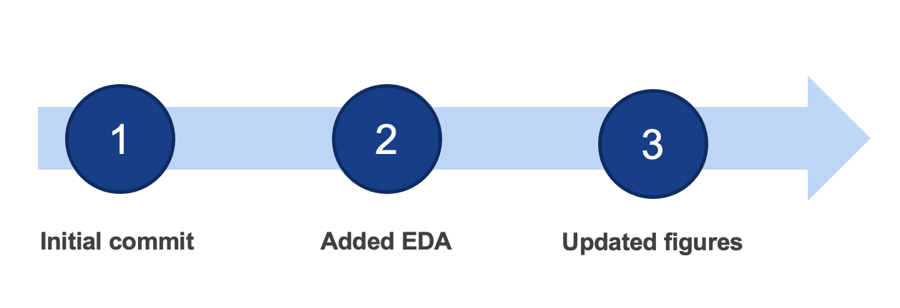

class: center, middle, inverse

```{r setup, include=FALSE}
options(htmltools.dir.version = FALSE)
```

# The challenge


---
class: left, top

# The challenge

As data analysts, we produce a lot of files

* code 
* figures 
* tables 
* reports 

Organising these files is an important, albeit often unglamorous, part of our job.  

--

*** 

**Managing versions** What do you do with old code? 

**Ensuring reproducibility** Can others reproduce your results? What about your future self? 

**Facilitating collaboration** Can other team members easily contribute?


---
class: center, middle, inverse

# The old school solution


---
class: left, top

# `r emo::ji("bicycle")` The old school solution

The old school solution combines many practical strategies:

* Using file naming conventions to track different file versions 

    * analysis-16jun20.do 
    * analysis-16jun20-mh.do 
    * analysis-final.do 
    * analysis-final-final.do

* Note changes directly in code comments or separate documentation

* Use shared folders, google drive etc 

* Share code and code snippets over email, slack etc 

--

*** 
This is ok(ish) for one person working on a small, brief project.

But if the project is **large**, involves **many people** or goes on for a **long time** this approach very quickly breaks down `r emo::ji("worried")`


---
class: left, top

# `r emo::ji("rocket")` The new school solution

The new school solution is to use dedicated **version control software**. 

There are a few options out there but by far the most popular choice is the combination of **Git** + **GitHub** `r fontawesome::fa(name = "github")`. 

--

.pull-left[


<a class = figLab href="https://git-scm.com/">Via git-scm.com</a>

Git is software for tracking different versions of code files you are working on **locally**. 
]

.pull-right[


<a class = figLab href="https://logos-world.net/wp-content/uploads/2020/11/GitHub-Logo-700x394.png/">Via logos-world.net</a>

Git Hub is a **cloud-based** platform for sharing and collaborating on projects managed with Git
]

---
class: center, inverse

# How does it work?

### Committing, branching and merging with Git


---
class: center, inverse

# How does it work?

### Committing, branching and merging with Git


---
class: center, inverse

# How does it work?

### Sharing versions with GitHub


---
class: center, inverse

# How does it work?

### Sharing versions with GitHub


---
class: middle, center, inverse

# It seems a bit complicated


<a class = figLab href="https://giphy.com/gifs/chloe-concerned-kaq6GnxDlJaBq/">Via GIPHY</a>

_Is it worth it?_

---
class: left, top, inverse

# Yes!! It is definitely worth it! 

--

**1. Version control** | Essential for reproducibility

--

**2. Collaboration** | [OpenSAFELY](https://github.com/opensafely), [OHDSI](https://github.com/OHDSI/Atlas), [R package development](https://github.com/tidyverse/tidyverse)

--

**3. Organisation** | e.g. Code, data & outputs all stored together

--

**4. Easy web presence** | e.g. any public GitHub repo; these slides! 

--

**5. Great for teaching** 

--

**6. Powerful search** 

--

**7. Issue tracking** | Hyperlink the bug, discussion about the bug & the solution!

--

**8. It is all _free*_** | *Well, mostly. The free products will cover most academic/research use cases. 


---
class: left, top

# Let's check out an example

.left-column[

If reading this at home explore the repo for: 

[Commit history](https://github.com/CBDRH/vaccineQueueNetworks/commits/main)

[Branches](https://github.com/CBDRH/vaccineQueueNetworks/network)

[Version comparison](https://github.com/CBDRH/vaccineQueueNetworks/commit/c0c56a376555b127279e5e0d9786b93b073f9dc7)

]

.right-column[

[](https://github.com/CBDRH/vaccineQueueNetworks)

https://github.com/CBDRH/vaccineQueueNetworks

]


---
class: left, top

# Let's check out an example

.left-column[

You can even compare difference versions of images! 

This works for PNG, JPG, GIF, and PSD

You can try this example [here](https://github.com/MarkHanly/getting-started-with-git-and-github/commit/6a071a9c63ee211e63417efba10a24042d0b0db3)

]

.right-column[


]


---
class: middle, center, inverse

# Are you in!?


<a class = figLab href="https://giphy.com/gifs/retro-thumbs-up-XreQmk7ETCak0/">Via GIPHY</a>


---
class: center, middle, inverse

# Interfacing with Git


---
class: left, top

# Working locally: **Git client**

To use Git on your computer you need a _Git Client_. There are [heaps](https://git-scm.com/downloads/guis) of git clients available, with different pros and cons. Here are a few examples:


.pull-left[

### 1. Command line 

* Terminal (Mac)

* Git bash (Windows)

* PowerShell (Windows)

### Downloads these from:

[git website](https://git-scm.com/download/) 

[git for windows](https://gitforwindows.org/)

]

.pull-right[


<a class = figLab href="https://gitforwindows.org/img/gw1.png/">Via gitforwindows.org</a>

]


---
class: left, top

# Working locally: **Git client**

To use Git on your computer you need a _Git Client_. There are [heaps](https://git-scm.com/downloads/guis) of git clients available, with different pros and cons. Here are a few examples:


.pull-left[

### 2. R Studio interface

* For R users!

* Check out [happygitwithr.com](https://happygitwithr.com/)

]

.pull-right[


]


---
class: left, top

# Working locally: **Git client**

To use Git on your computer you need a _Git Client_. There are [heaps](https://git-scm.com/downloads/guis) of git clients available, with different pros and cons. Here are a few examples:


.pull-left[

### 3. SAS Enterprise Guide 8 interface

* For SAS users!

* [Understanding Git Integration in SAS Enterprise Guide](https://documentation.sas.com/doc/en/egcdc/8.2/egdoccdc/egug/p1ov5qodzk4ur2n1r200wdr5jz75.htm)

* Similar integration in SAS Studio

]

.pull-right[


<a class = figLab href="https://documentation.sas.com/api/docsets/egug/8.2/content/images/git_repositorytab.png">Via documentation.sas.com</a>

]


---
class: left, top

# Working locally: **Git client**

To use Git on your computer you need a _Git Client_. There are [heaps](https://git-scm.com/downloads/guis) of git clients available, with different pros and cons. Here are a few examples:


.pull-left[

### 4. Tortoise Git

* Windows integration to file explorer 

* If you want to point and click

* https://tortoisegit.org/ 

]

.pull-right[


]


---
class: left, top

# Collaboration: **Git hosting service**

To enable collaboration you need a _Git Hosting service_. There are heaps of [options](https://git.wiki.kernel.org/index.php/GitHosting) with different pros and cons, but the core functionality is usually the same.  


.left-column[

### GitHub

Probably the most popular hosting service so there are lots of tutorials and resources available online. 

]

.right-column[


<a class = figLab href="https://logos-world.net/wp-content/uploads/2020/11/GitHub-Logo-700x394.png/">Via logos-world.net</a>

]


---
class: left, top

# Collaboration: **Git hosting service**

To enable collaboration you need a _Git Hosting service_. There are heaps of [options](https://git.wiki.kernel.org/index.php/GitHosting) with different pros and cons, but the core functionality is usually the same.   

.left-column[

### Gitea 

A light-weight easy to install option.

Implemented in ERICA. 

]

.right-column[


<a class = figLab href="https://www.vectorlogo.zone/logos/giteaio/giteaio-ar21.png/">Via vectorlogo.zone</a>

]


---
class: left, top

# Collaboration: **Git hosting service**

To enable collaboration you need a _Git Hosting service_. There are heaps of [options](https://git.wiki.kernel.org/index.php/GitHosting) with different pros and cons, but the core functionality is usually the same.  

.left-column[

### GitLab

Can be hosted on private server so ideal for sensitive projects.

Implemented in SURE. 

]

.right-column[


<a class = figLab href="https://upload.wikimedia.org/wikipedia/commons/thumb/e/e1/GitLab_logo.svg/1024px-GitLab_logo.svg.png/">Via wikimedia.org</a>
]


---
class: center, middle, inverse

# Key concepts


---
class: left, top

# Key concept: Repository 

.pull-left[


]

.pull-right[

### A repository is where the magic happens `r emo::ji('wizard')`

* Referred to as a repo 
* Database of changes to your code (aka _diffs_)
* Hidden folder on your system named **.git**

Once you initialise a git repo in a folder, git is ready to start tracking changes to all the files and subfolders therein. 

]


---
class: left, top

# Key concept: Commit 

.pull-left[



]

.pull-right[

### Commit

* A Commit is like clicking save in a MS Word document 

* It saves a snapshot of the code at that point in time 

* Why you commit you must write a message explaining what changed

* Committing is a two stage process - more on this later

]


---
class: left, top

# Key concept: Diff 

.pull-left[


]

.pull-right[

### Diff

* A diff is the set of changes between two versions of a file 

* When you commit, it is the _diff_ that gets recorded, not the whole version

* The screenshot highlights a single diff: deletion of the word "clinic" 

]


---
class: center, middle, inverse

# Workflow


---
class: center, top, inverse

# Workflow


---
class: center, top, inverse

# Workflow


---
class: center, top

# Workflow

How you actual perform these commands depends on the git client you are using...

.pull-left[

]

.pull-right[

]


For today's exercises we will be using _the scary black box_.

---
class: center, middle, inverse

# Frequently asked questions 

---
class: left, top

# Frequently asked questions 

### What files can I track? 

***

--

This all works best for non-binary or text files e.g. your typical code files (.sas, .do, .R, .Rmd, .py) but also .png, .csv etc

You can include non-binary files (.pdf, .docx, .xlsx etc) in a git repo but the diff features won't work. It can still be useful if using the repo as a central orgnaisation point (e.g. if you save your published manuscript with the analysis code). 


---
class: left, top

# Frequently asked questions 

### How often should I commit? 

***

--

Well, it depends.

Just like when you start writing a word document you might not click save very often as you spew out lots of ideas, but at the end of your thesis you will carefully save evey change! 

It is best practice to keep commits fairly small and related, especially for mature projects. 


---
class: left, top

# Frequently asked questions 

### What's with the staging area? 

***

--

There are advantages of breaking up the commit into two steps 

* You can split a big edit into bite-sized pieces 

* Easier to review

* If you make a mistake you can _unstage_. You can't un-commit!


---
class: left, top

# Frequently asked questions 

### What about my sensitive data/code? 

***

--

If your data are sensitive be very careful not to track with Git (more tips on this later). 

Private repos are available if you don't want the public to see your code (you can change to public later if desired.)

---
class: left, top

# Frequently asked questions 

### How does my repo align with my project folder?

***

--

Just like when you create project folders and sub-folders you need to put some thought into how to organise your repos.

One option is to initiate the repo in the root folder of the project, meaning that all files and subfolders are tracked by default. 

An alternative would be to initiate the repo in a specific folder, e.g. your `Code` folder, and keep your data in a separate `Data` folder.

In either approach you can specify any files or folders that Git should ignore in a special file named `.gitignore`. 

---
class: center, middle

# Any other questions? 


<a class = figLab href="https://giphy.com/gifs/animation-flower-2d-3oxRmsoHngzymwDl2E">Via GIPHY</a>

---
class: center, middle, inverse

# Exercises


---
class: left, top, inverse 

.left-column[

<br>


<a class = figLab href="https://giphy.com/gifs/text-motivational-inchworm-RiZo1rFLXSP0cPtEd2">Via GIPHY</a>

<br>

Good luck! `r emo::ji("shamrock")`

]

.right-column[

#### Overview of exercises

* Exercise 1 - 3: Working locally with Git `r emo::ji("car")`

* Exercise 4: Configuring GitHub + Git `r emo::ji("airplane")`

* Exercise 5 - 7: Working with Git and GitHub `r emo::ji("rocket")`

***


#### Tips for Success

* You will be entering commands into Git Bash or the Terminal. **Enter the commands carefully!** **A** versus **a** or **-** versus **--** will make a difference! 

* **Pay attention to any messages** git returns. They're often incomprehensible but will flag if something has gone wrong. 

* Use <span class=myCode>git status</span> often to confirm the current state of your repo. 

* You can use tab in Git Bash/Terminal to auto-complete file and folder names

* `ctrl+V` doesn't work to paste into Git Bash, use `insert` or `Right Click -> Edit -> Paste`

]

---
class: left, top

### Useful shell commands

```{r table2, echo=FALSE, message=FALSE, warnings=FALSE, results='asis'}
tabl <- "
| Command       | Action           |
|-              |:--               |
| cd            | Change directory (e.g. cd ‘H:/My Documents’) |
| pwd           | Print working directory      |
| ls | List files      | 
| mkdir         | Create a new directory (e.g. ‘mkdir NewProject’) |
| touch         | Create a new file (e.g. ‘touch mynewlist.txt’)      |
| ..            | Refers to the folder up one level (e.g. ‘cd ..’) | 
| git init      | Initialise a new git repository |
| git status    | Check the status of a Git repository |
| git add       | Add a specific file to the staging area (e.g. ‘git add code.sas’)      | 
| git add -A    | Add all files with changes to the staging area |
| git commit -m “msg”     | Commit files in the staging area  |
| git pull      | Download changes from a remote repository      | 
| git push      | Upload local commits to a remote repository |
| git clone     | Copy an existing repo from GitHub etc      |
"

cat(tabl) # output the table in a format good for HTML/PDF/docx conversion
```

---
class: left, top

# Exercise 1 of 7 `r emo::ji("weight")`

### Practice using the shell

.left-column[

### Task 
Create a new folder and empty text file using GitBash (Windows) or Terminal (Mac)

**Note** Ctrl+V doesn’t work in GitBash, right-click instead. You may need to adjust the settings.

]

.right-column[

1. Open GitBash/Terminal

1. Use the <span class=myCode>cd</span> command (change directory) to navigate to the location you want to create your new folder. If you're not sure where you are pointing <span class=myCode>pwd</span> (print working directory) and <span class=myCode>ls</span> (list) are useful. 

1. Use the `mkdir` command to create a new folder named GitDemo. Enter <span class=myCode>mkdir GitDemo</span>

1. Use the `cd` command again to change directory to the new folder. Enter <span class=myCode> cd GitDemo</span>

1. Use the `touch` command to create a new text file named method.txt. Enter <span class=myCode> touch method.txt</span>

]


---
class: left, top

# Exercise 2 of 7 `r emo::ji("weight")``r emo::ji("weight")`

### Configure git

.left-column[

### Task 
Configure Git with your username and email
]

.right-column[

Using GitBash or Terminal, configure Git with your username and email by entering the commands below:

1. <span class=myCode>git config --global user.name "John Doe”</span>

1. <span class=myCode>git config --global user.email johndoe@example.com
</span>

To check it has worked you can enter <span class=myCode>git config --list
</span> and you should see your user name and email listed among your configuration settings. 

]


---
class: left, top

# Exercise 3 of 7 `r emo::ji("weight")``r emo::ji("weight")``r emo::ji("weight")`

### Practice local git workflow

.left-column[

### Task 
Initialise a git repo then add and commit changes to your file
]

.right-column[

1. Make sure you are in your new folder: <span class=myCode>cd GitDemo</span>

1. Initialise a git repo: <span class=myCode>git init</span>

1. Check the status of your repo: <span class=myCode>git status</span> (You should see that method.txt is untracked)

1. Open method.txt with your preferred text editor & write a short list or recipe. After each item:

    1. Save the file as you usually would

    1. Stage the file: <span class=myCode>git add -A</span>

    1. Commit the file: <span class=myCode>git commit -m “your message here”</span>

1. Enter <span class=myCode>git log</span> to view a log of your changes

]

---
class: left, top

# Exercise 4 of 7 `r emo::ji("weight")``r emo::ji("weight")``r emo::ji("weight")``r emo::ji("weight")`

### Sync Git and GitHub

.left-column[

### Task 
Create a personal access token (PAT) on GitHub and use it to authenticate your account. 
]

.right-column[

Follow steps 1-9 on **Creating a personal access token** here: https://docs.github.com/en/authentication/keeping-your-account-and-data-secure/creating-a-personal-access-token

]

---
class: left, top

# Exercise 5 of 7 `r emo::ji("weight")``r emo::ji("weight")``r emo::ji("weight")``r emo::ji("weight")``r emo::ji("weight")`

### Host your repo on GitHub

.left-column[

### Task 
Push your local git repo to a GitHub repo
]

.right-column[

1. Create a new public repo in GitHub (use + button in top right-hand corner)

1. Name it something unique or give it the same name as your project folder.

1. No need to initialize a README, add a .gitignore or license

1. When you are ready select **Create Repository**

1. Follow the instructions to push an existing repository from the command line (copy code into GitBash/Terminal)
You should now be able to explore your history on GitHub

]

---
class: left, top

# Exercise 6 of 7 `r emo::ji("weight")``r emo::ji("weight")``r emo::ji("weight")``r emo::ji("weight")``r emo::ji("weight")``r emo::ji("weight")`

### Clone a remote repo

.left-column[

### Task 
Clone a GitHub repo to your local computer
]

.right-column[

1. Go to https://github.com/MarkHanly/getting-started-practice

1. Click on the green <span style="background:#2da44e; color:white; border: 1px solid; border-radius: 6px;">Code</span> button and copy the HTTPS url to your clipboard.

1. Using GitBash/Terminal, use `cd` to navigate to a location you want to clone this practice repo. **Don’t clone it into the repo you created earlier!**

1. Enter <span class=myCode>git clone https://github.com/MarkHanly/getting-started-practice.git`</span> to clone the practice repo locally (this is the url you've just copied so you can paste it in)

You should now be able to see the repo files copied locally.

]


---
class: left, top

# Exercise 7 of 7 `r emo::ji("weight")``r emo::ji("weight")``r emo::ji("weight")``r emo::ji("weight")``r emo::ji("weight")``r emo::ji("weight")``r emo::ji("weight")`

### Make changes and push back to GitHub

.left-column[

### Task 
Add a new file to the practice repo and push
]

.right-column[

1. Navigate to the newly cloned repo: <span class=myCode>cd getting-started-practice</span>
1. Create a new branch (name the branch with your name so that it is unique): <span class=myCode>git checkout -b mhanly-branch</span>
1. Add a new .txt file (name the file with your name so that it is unique): <span class=myCode>touch mhanly-edits.txt</span>
1. Open the new .txt file in the usual way, write a line or two and click save. 
1. Confirm you have edited the file: <span class=myCode>git status</span>
1. Use <span class=myCode>git add -A</span> and <span class=myCode>git commit -m “message”</span> as before to add and commit changes
1. Push your local changes to the GitHub repo <span class=myCode>git push --set-upstream origin mhanly-branch</span>

If you managed to complete those steps you should now see your branch listed under https://github.com/MarkHanly/getting-started-practice/branches 
]


---
class: left, top, inverse 

# Where to go next?

.left-column[


<a class = figLab href="https://giphy.com/gifs/xpost-river-salmon-zuj3kcjbGj9qE?utm_source=media-link&utm_medium=landing&utm_campaign=Media%20Links&utm_term=">Via GIPHY</a>

See the References and Resources slide for suggestions on where to go next.
]

.right-column[
Git and Github are powerful tools with numerous features. We have only scraped the surface, focussing on the simplest elements of an individual workflow but the real benefits come with collaboration.

*** 

Collaborating effectively requires additional steps that haven't been covered in these intro slides:

**branching** | spawn a new branch to develop new features

**merging** | combine separate branches back together

**pull requests** | request your feature branch to be integrated into the code base

]

---
class: left, top 

# References and resources

**High level (convince yourself and your team)**

* Jennifer Bryan (2018) [Excuse Me, Do You Have a Moment to Talk About Version Control?](https://doi.org/10.1080/00031305.2017.1399928), The American Statistician, 72:1, 20-27

* Kieran Healy (2019) [The Plain Person’s Guide to Plain Text Social Science](https://plain-text.co/index.html#introduction)

**Software focus**

* [Happy Git and GitHub for the useR](https://happygitwithr.com/) by Jennifer Bryan

* [Understanding Git Integration in SAS Enterprise Guide](https://documentation.sas.com/doc/en/egcdc/8.2/egdoccdc/egug/p1ov5qodzk4ur2n1r200wdr5jz75.htm) SAS documentation

* [Stata and GitHub Integration](https://medium.com/the-stata-guide/stata-and-github-integration-8c87ddf9784a) A medium.com blogpost by Asjad Naqvi

**Comprehensive references**

* [Atlassian tutorials](https://www.atlassian.com/git/tutorials/what-is-version-control) (These are excellent but focus on git+Bitbucket rather than git+GitHub)

* Chacon, S., & Straub, B. (2014). Pro git Springer Nature. (available [online]((https://git-scm.com/book/en/v2))

* [GitHub docs](https://docs.github.com/en)

---
class: left, middle, inverse

# Thank you for taking part! `r emo::ji("pray")`

If this was useful for you, or if you have any questions or suggestions, please let me know at [m.hanly@unsw.edu.au](mailto:m.hanly@unsw.edu.au) `r emo::ji("slightly_smiling_face")`

Slides created via the R package [**xaringan**](https://github.com/yihui/xaringan) and hosted on [**netlify**](https://www.netlify.com/). Thank you to **Dr Malcolm Gillies** for input on these slides `r emo::ji("rocket")`

Feel free to share, the url is [getting-started-with-git-and-github.netlify.app](https://getting-started-with-git-and-github.netlify.app).

The source code for these slides is available at [github.com/MarkHanly/getting-started-with-git-and-github](https://github.com/MarkHanly/getting-started-with-git-and-github). Issues can be added [here](https://github.com/MarkHanly/getting-started-with-git-and-github/issues).

---
class: center, middle, inverse

<a rel="license" href="http://creativecommons.org/licenses/by-nc-sa/4.0/"></a><br /><span xmlns:dct="http://purl.org/dc/terms/" href="http://purl.org/dc/dcmitype/InteractiveResource" property="dct:title" rel="dct:type">Getting Started with Git and GitHub</span> by <span xmlns:cc="http://creativecommons.org/ns#" property="cc:attributionName">Mark Hanly</span> is licensed under a <a rel="license" href="http://creativecommons.org/licenses/by-nc-sa/4.0/">Creative Commons Attribution-NonCommercial-ShareAlike 4.0 International License</a>.

