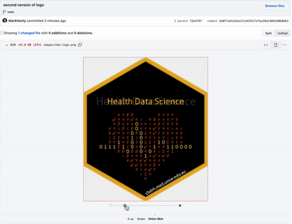

class: center, middle, inverse

```{r setup, include=FALSE}
options(htmltools.dir.version = FALSE)
```

# The challenge


---
class: left, top

# The challenge

As data analysts, we produce a lot of files

* code 
* figures 
* tables 
* reports 

Organising these files, and **keeping track of different versions** is an important, albeit often unglamorous, part of our job. 


---
class: center, middle, inverse

# The old school solution


---
class: left, top

# `r emo::ji("bicycle")` The old school solution

The old school solution combines many practical strategies:

* Using file naming conventions to track different file versions 

    * analysis-16jun20.do 
    
    * analysis-16jun20-mh.do 
    
    * analysis-final.do 
    
    * analysis-final-final.do


* Use shared folders, google drive etc 

* Share code and code snippets over email, slack etc 


---
class: center, middle, inverse

# The new school solution

---
class: left, top

# `r emo::ji("rocket")` The new school solution

The new school solution is to use dedicated **version control software**. 

There are a few options out there but by far the most popular choice is the combination of **Git** + **GitHub** `r fontawesome::fa(name = "github")`. 

--

.pull-left[


Git is software for tracking different versions of code files you are working on **locally**. 
]

.pull-right[


Git Hub is a **cloud-based** platform for sharing and collaborating on projects managed with Git
]

---
class: center, inverse

# How does it work?


---
class: center, inverse

# How does it work?


---
class: center, inverse

# How does it work?


---
class: center, inverse

# How does it work?


---
class: middle, center, inverse

# It seems a bit complicated


_Is it worth it?_

---
class: left, top, inverse

# Yes!! It is definitely worth it! 

1. Version control 

1. Collaboration

1. Organisation 

1. Automatic web presence 

1. Great for teaching

1. Powerful search

1. Issue tracking

1. It is all _free_

--

All of these promote **reproducibility** `r emo::ji('party')` and **transparency** `r emo::ji('stars')`

---
class: left, top

# Let's check out an example

.left-column[

If reading this at home explore the repo for: 

[Commit history](https://github.com/CBDRH/vaccineQueueNetworks/commits/main)

[Branches](https://github.com/CBDRH/vaccineQueueNetworks/network)

[Version comparison](https://github.com/CBDRH/vaccineQueueNetworks/commit/c0c56a376555b127279e5e0d9786b93b073f9dc7)

]

.right-column[

[](https://github.com/CBDRH/vaccineQueueNetworks)

https://github.com/CBDRH/vaccineQueueNetworks

]


---
class: left, top

# Let's check out an example

.left-column[

You can even compare difference versions of images! 

This works for PNG, JPG, GIF, and PSD

You can try this example [here](https://github.com/MarkHanly/getting-started-with-git-and-github/commit/6a071a9c63ee211e63417efba10a24042d0b0db3)

]

.right-column[



]


---
class: middle, center, inverse

# Are you in!?


---
class: center, middle, inverse

# Interfacing with Git


---
class: left, top

# Working locally: **Git client**

To use Git on your computer you need a _Git Client_


.pull-left[

### Command line 

* Terminal (Mac)

* Git bash (Windows)

]

.pull-right[


]


---
class: left, top

# Working locally: **Git client**

To use Git on your computer you need a _Git Client_


.pull-left[

### R Studio interface

* R users should check out [happygitwithr.com](https://happygitwithr.com/)

]

.pull-right[


]


---
class: left, top

# Working locally: **Git client**

To use Git on your computer you need a _Git Client_


.pull-left[

### Tortoise Git

* Windows integration to file explorer 

* https://tortoisegit.org/ 

]

.pull-right[


]


---
class: left, top

# Collaboration: **Git hosting service**

To enable collaboration you need a _Git Hosting service_. There are heaps of [options](https://git.wiki.kernel.org/index.php/GitHosting) with different pros and cons, but the core functionality is usually the same.  


.left-column[

### GitHub

Probably the most popular hosting service so there are lots of tutorials and resources available online. 

]

.right-column[


]


---
class: left, top

# Collaboration: **Git hosting service**

To enable collaboration you need a _Git Hosting service_. There are heaps of [options](https://git.wiki.kernel.org/index.php/GitHosting) with different pros and cons, but the core functionality is usually the same.   

.left-column[

### Gitea 

A light-weight easy to install option. Implemented in ERICA. 

]

.right-column[


]


---
class: left, top

# Collaboration: **Git hosting service**

To enable collaboration you need a _Git Hosting service_. There are heaps of [options](https://git.wiki.kernel.org/index.php/GitHosting) with different pros and cons, but the core functionality is usually the same.  

.left-column[

### GitLab

Can be hosted on private server so ideal for sensitive projects. Implemented in SURE. 

]

.right-column[


]


---
class: center, middle, inverse

# Key concepts


---
class: left, top

# Key concept: Repository 

.pull-left[


]

.pull-right[

### A repository is where the magic happens `r emo::ji('wizard')`

* Referred to as a repo 
* Database of changes to your code (aka _diffs_)
* Hidden folder on your system named **.git**

Once you initialise a git repo in a folder, git is ready to start tracking changes to all the files and subfolders therein. 

]


---
class: left, top

# Key concept: Diff 

.pull-left[


]

.pull-right[

### Diff

* A diff is the set of changes between two versions of a file 

* The screenshot highlights a single diff: deletion of the word "clinic" 

]


---
class: left, top

# Key concept: Commit 

.pull-left[


]

.pull-right[

### Commit

* A Commit is like clicking save in a MS Word document 

* It saves a snapshot of the code at that point in time 

* Each commit has a message explaining what changed

]


---
class: center, middle, inverse

# Workflow


---
class: center, top, inverse

# Workflow


---
class: center, top, inverse

# Workflow


---
class: center, top

# Workflow

How you actual perform these commands depends on the git client you are using...

.pull-left[

]

.pull-right[

]


For today's exercises we will be using _the scary black box_.

---
class: center, middle, inverse

# Frequently asked questions 

---
class: left, top

# Frequently asked questions 

## What files can I track? 

--

This all works best for non-binary or text files e.g. your typical code files (.sas, .do, .R, .Rmd, .py) but also .png, .csv etc

You can include non-binary files (.pdf, .docx, .xlsx etc) in a git repo but the diff features won't work. It can still be useful if using the repo as a central orgnaisation point (e.g. if you save your published manuscript with the analysis code). 


---
class: left, top

# Frequently asked questions 

## How often should I commit? 

--

Well, it depends. Just like when you start writing a word document you might not click save very often as you spew out lots of ideas, but at the end of your thesis you will carefully save evey change! 

It is best practice to keep commits fairly small and related, especially for mature projects. 


---
class: left, top

# Frequently asked questions 

## What about my sensitive data/code? 

--

If your data are sensitive be very careful not to track with Git (more tips on this later). 

Private repos are available if you don't want the public to see your code (you can change to public later if desired.)

---
class: left, top

# Frequently asked questions 

## How does my repo line up with my project folder?

--

Just like when you create project folders and sub-folders you need to put some thought into how to organise your repos.

One option is to initiate the repo in the root folder of the project, meaning that all files and subfolders are tracked by default. 

An alternative would be to initiate the repo in a specific folder, e.g. your `Code` folder, and keep your data in a separate `Data` folder.

In either approach you can specify any files or folders that Git should ignore in a special file named `.gitignore`. 

---
class: center, middle

# Any other questions? 


---
class: center, middle, inverse

# Exercises

---
class: left, top

# Exercise 1 of 7 `r emo::ji("weight")`

### Practice using the shell

.left-column[

### Task 
Create a new folder and empty text file using GitBash (Windows) or Terminal (Mac)

**Note** Ctrl+V doesn’t work in GitBash, right-click instead. You may need to adjust the settings.

]

.right-column[

1. Open GitBash/Terminal

1. Use the `cd` command to navigate to the location you want to create your new folder

1. Use the `mkdir` command to create a new folder named GitDemo. Enter <span style="font: Courier; color: #F82472;"> mkdir GitDemo</span>

1. Use the `cd` command again to change directory to the new folder. Enter <span style="font: Courier; color: #F82472;"> cd GitDemo</span>

1. Use the `touch` command to create a new text file named method.txt. Enter <span style="font: Courier; color: #F82472;"> touch method.txt</span>

1. Practice the commands `ls` (list) and `pwd` (print working directory)

]


---
class: left, top

# Exercise 2 of 7 `r emo::ji("weight")``r emo::ji("weight")`

### Configure git

.left-column[

### Task 
Configure Git with your username and email
]

.right-column[

Using GitBash or Terminal, configure Git with your username and email by entering the commands below:

1. <span style="font: Courier; color: #F82472;">git config --global user.name "John Doe”</span>

1. <span style="font: Courier; color: #F82472;">git config --global user.email johndoe@example.com
</span>

To check it has worked you can enter <span style="font: Courier; color: #F82472;">git config --list
</span> and you should see your user name and email listed among your configuration settings. 

]


---
class: left, top

# Exercise 3 of 7 `r emo::ji("weight")``r emo::ji("weight")``r emo::ji("weight")`

### Configure git

.left-column[

### Task 
Initialise a git repo then add and commit changes to your file
]

.right-column[

1. Make sure you are in your new folder: <span style="font: Courier; color: #F82472;">cd GitDemo</span>

1. Initialise a git repo: <span style="font: Courier; color: #F82472;">git init</span>

1. Check the status of your repo: <span style="font: Courier; color: #F82472;">git status</span> (You should see that method.txt is untracked)

1. Open method.txt with your preferred text editor & write a short list or recipe. After each item:

    1. Save the file as you usually would

    1. Stage the file: <span style="font: Courier; color: #F82472;">git add -A</span>

    1. Commit the file: <span style="font: Courier; color: #F82472;">git commit -m “your message here”</span>

1. Enter <span style="font: Courier; color: #F82472;">git log</span> to view a log of your changes

]

---
class: left, top

# Exercise 4 of 7 `r emo::ji("weight")``r emo::ji("weight")``r emo::ji("weight")``r emo::ji("weight")`

### Sync Git and GitHub

.left-column[

### Task 
Create a personal access token (PAT) on GitHub and use it to authenticate your account. 
]

.right-column[

Follow steps 1-9 on **Creating a personal access token** here: https://docs.github.com/en/authentication/keeping-your-account-and-data-secure/creating-a-personal-access-token

]

---
class: left, top

# Exercise 5 of 7 `r emo::ji("weight")``r emo::ji("weight")``r emo::ji("weight")``r emo::ji("weight")``r emo::ji("weight")`

### Host your repo on GitHub

.left-column[

### Task 
Push your local git repo to a GitHub repo
]

.right-column[

1. Create a new public repo in GitHub (use + button in top right-hand corner)

1. Name it something unique or give it the same name as your project folder.

1. No need to initialize a README, add a .gitignore or license

1. When you are ready select **Create Repository**

1. Follow the instructions to push an existing repository from the command line (copy code into GitBash/Terminal)
You should now be able to explore your history on GitHub

]

---
class: left, top

# Exercise 6 of 7 `r emo::ji("weight")``r emo::ji("weight")``r emo::ji("weight")``r emo::ji("weight")``r emo::ji("weight")``r emo::ji("weight")`

### Clone a remote repo

.left-column[

### Task 
Go to partners GitHub repo, copy URL, then clone
]

.right-column[

Pair up and complete these in tandem with your partner.

1. Add your partner as a collaborator in your new GitHub repo (Settings > Manage Access > Invite a collaborator)

1. Go to your partner’s GitHub repo and click on the clone link to get the HTTP url

1. Using GitBash/Terminal, use `cd` to navigate to a location you want to clone your partners repo (This will create a local copy of their repo. Don’t clone it into your own repo!)

1. Enter `git clone <your partners url>` to clone their repo: for example:
	<span style="font: Courier; color: #F82472;">git clone https://github.com/MarkHanly/GitPrax.git</span>

]


---
class: left, top

# Exercise 7 of 7 `r emo::ji("weight")``r emo::ji("weight")``r emo::ji("weight")``r emo::ji("weight")``r emo::ji("weight")``r emo::ji("weight")``r emo::ji("weight")`

### Collaborate

.left-column[

### Task 
Make changes to your partners file and push. Pull your partners changes
]

.right-column[

Pair up and complete these in tandem with your partner.

1. Open your partner’s methods.txt file using your preferred text editor
1. Edit their list and save the file
1. Use <span style="font: Courier; color: #F82472;">cd</span> to navigate inside your locally cloned copy of your partner’s repo
1. Use <span style="font: Courier; color: #F82472;">git status</span> to confirm you have edited the file
1. Use <span style="font: Courier; color: #F82472;">git add -A</span> and <span style="font: Courier; color: #F82472;">git commit -m “message”</span> as before to add and commit changes
1. Use <span style="font: Courier; color: #F82472;">git push</span> to push your local changes to your partner’s GitHub repo
1. Use <span style="font: Courier; color: #F82472;">cd</span> to navigate back to your own repo
1. Use <span style="font: Courier; color: #F82472;">git pull</span> to sync in your partner’s changes

]


---
class: left, top 

# References and resources

1. Jennifer Bryan (2018) [Excuse Me, Do You Have a Moment to Talk About Version Control?](https://doi.org/10.1080/00031305.2017.1399928), The American Statistician, 72:1, 20-27, DOI: 10.1080/00031305.2017.1399928

1. [Happy Git and GitHub for the useR](https://happygitwithr.com/) by Jennifer Bryan

1. Chacon, S., & Straub, B. (2014). Pro git Springer Nature. (available [online]((https://git-scm.com/book/en/v2))

1. [GitHub docs](https://docs.github.com/en)

---
class: left, middle, inverse

# Thank you for taking part! `r emo::ji("pray")`

If this was useful for you, or if you have any questions or suggestions, please let me know at [m.hanly@unsw.edu.au](mailto:m.hanly@unsw.edu.au) `r emo::ji("smile")`

Slides created via the R package [**xaringan**](https://github.com/yihui/xaringan) and hosted on [**netlify**](https://www.netlify.com/).

Feel free to share these slides, the url is [getting-started-with-git-and-github.netlify.app](https://getting-started-with-git-and-github.netlify.app).

The source code for these slides is available at [github.com/MarkHanly/getting-started-with-git-and-github](https://github.com/MarkHanly/getting-started-with-git-and-github). Issues can be added [here](https://github.com/MarkHanly/getting-started-with-git-and-github/issues).

---
class: center, middle, inverse

<a rel="license" href="http://creativecommons.org/licenses/by-nc-sa/4.0/"></a><br /><span xmlns:dct="http://purl.org/dc/terms/" href="http://purl.org/dc/dcmitype/InteractiveResource" property="dct:title" rel="dct:type">Getting Started with Git and GitHub</span> by <span xmlns:cc="http://creativecommons.org/ns#" property="cc:attributionName">Mark Hanly</span> is licensed under a <a rel="license" href="http://creativecommons.org/licenses/by-nc-sa/4.0/">Creative Commons Attribution-NonCommercial-ShareAlike 4.0 International License</a>.

